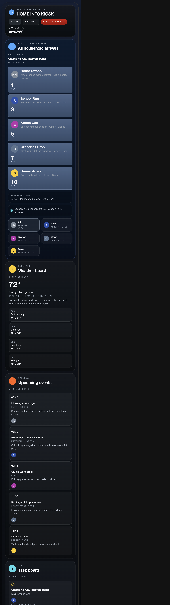
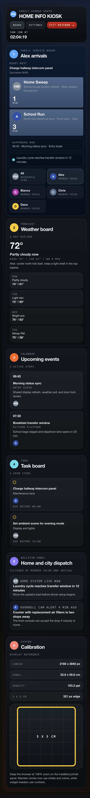
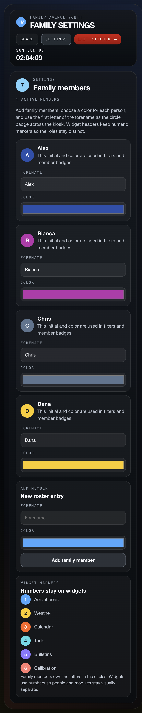

# subway

Portrait-first family smart home kiosk UI with a dark transit-inspired visual language.

## Overview

The app in `frontend/` is a fullscreen authenticated household information board designed for a 27 inch 4K display in portrait mode. The current board combines a family arrival board, weather, calendar, and todo widgets with a fixed lower expanded-detail stage plus a settings surface for family members, widget metadata, widget settings, and calendar management.

Current highlights:

- Cookie-based authentication gates the app and keeps data isolated per user
- Board copy is localized for English, German, French, and Spanish
- Weather conditions are localized in the frontend and the compact forecast now shows eight days in a 2 x 4 layout
- The active household filter and selected expanded widget survive reloads per user in local app-shell storage
- Family members, widget metadata, widget settings, app preferences, calendar events, and todo items persist in SQLite
- The board layout uses a service board, a two-column widget grid, and a reserved lower expanded stage for detail views

## Screenshots

### Home board



### Member-focused board



### Family settings



## GUI Exploration Guide

See the Epic 001 exploration guide for hands-on GUI tasks:

`project_management/epics/001_WIDGET_ARCHITECTURE/001_WIDGET_ARCHITECTURE__GUI_EXPLORATION_GUIDE.md`

## Run it

```bash
npm --prefix frontend install
npm --prefix backend run dev
```

In a second terminal:

```bash
npm --prefix frontend run dev
```

Local development access:

- Frontend dev server: `http://localhost:5173`
- Backend API: `http://127.0.0.1:8787`

The app bootstraps through `GET /api/auth/session`. All non-auth `/api/*` routes require a valid session cookie.

## Run it with Docker

```bash
docker compose up --build -d
```

Local access:

- App: `http://localhost:8081`
- Auth/session probe: `http://localhost:8081/api/auth/session`

Useful commands:

```bash
docker compose logs -f
docker compose down
```

The Dockerized backend now stores its runtime SQLite data in Docker-managed persistent storage mounted at `/app/data`.

For local development, the backend data is kept in the named Docker volume:

- `subway_subway-data`

On the VPS, the deployment also uses the named Docker volume:

- `subway_subway-data`

The legacy host-path database location is still used only as a migration source during deploy:

- `/home/swaibian/apps/subway/backend/data/subway.sqlite`

## Production check

```bash
npm --prefix backend start
```

In a second terminal:

```bash
npm --prefix frontend run build
npm --prefix frontend run preview
```

## GitHub Actions deployment

The repository includes `.github/workflows/docker-build-deploy.yml`.

What it does:

- Builds and pushes backend and frontend images to GHCR
- Uploads `compose.yml`, `compose.vps.yml`, and a generated `deploy.env` file to the VPS
- Creates a timestamped backup of the live VPS database before each deploy when a volume-backed database already exists
- Migrates the legacy VPS host-path database into the named Docker volume when the volume is empty
- Verifies the configured public app port is free unless an existing subway deployment already owns it
- Pulls the tagged images on `client.scaico.com` as user `swaibian`
- Restarts the stack with `docker compose up -d --no-build --remove-orphans`

Required GitHub secret:

- `VPS_SSH_KEY`: private SSH key for `swaibian@client.scaico.com`

The VPS must already have Docker Engine with the Docker Compose v2 plugin installed.

The workflow currently binds subway to host port `8081` on the VPS because ports `80` and `443` are already occupied by the existing shared Nginx stack on `client.scaico.com`.

`compose.vps.yml` also joins the subway frontend to the existing Docker network `scaico-client_default` with the alias `subway-frontend`, so the shared Nginx stack can reverse-proxy it.

The workflow smoke-tests the app from inside the VPS with `curl http://127.0.0.1:8081/api/auth/session`, so deployment is not blocked by the server's current public ingress rules.

The intended public route is `https://client.scaico.com/subway/`, which requires a matching reverse-proxy route in the existing Nginx stack.

The backend readiness checks use `/api/auth/session`, which remains publicly readable even after the authenticated data endpoints are locked down.

## Persistence safety

- Local Docker runs use the named volume `subway_subway-data`, so normal rebuilds and restarts do not wipe the database.
- The VPS deploy workflow now backs up the live database into `${DEPLOY_PATH}/backups/` before replacing containers.
- The VPS deploy workflow also imports the legacy host-path database into the named volume if the volume is empty, preventing accidental fresh starts during the storage-model transition.
- Avoid `docker compose down -v` unless you intentionally want to delete the database volume.

## Backend persistence

- The backend uses a local SQLite database at `backend/data/subway.sqlite`.
- Cookie-based auth stores users and sessions on the backend; `GET /api/auth/session` stays public and the remaining `/api/*` routes require authentication.
- Family members, widget metadata, widget settings, app preferences, calendar events, and todo items are stored in backend persistence.
- The frontend loads authenticated data through `/api/family-members`, `/api/widgets`, `/api/widget-settings`, `/api/app-preferences`, `/api/calendar-events`, `/api/todo-items`, and `/api/weather`.
- The active household filter and selected expanded widget are also persisted locally in browser storage per user for reload continuity.
- Retired widgets are pruned on backend startup when their source location and widget id are no longer supported by the seed list.
- For local development, Vite proxies `/api` to `http://127.0.0.1:8787`.

## Display notes

- Target resolution: `2160 x 3840 px`
- Target orientation: portrait
- Target panel size: 27 inch, 16:9
