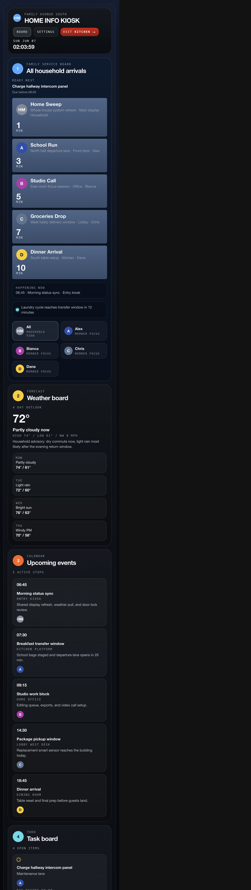
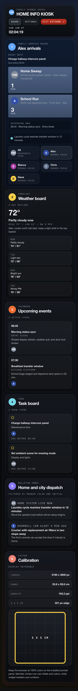
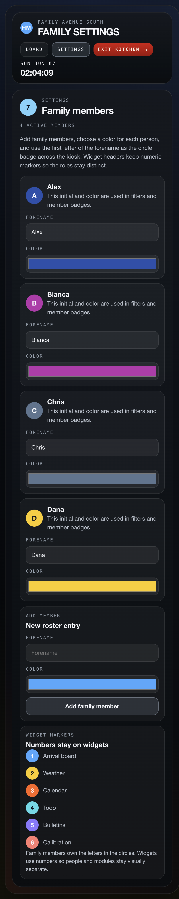

# subway

Portrait-first family smart home kiosk UI with a dark transit-inspired visual language.

## Overview

The app in `frontend/` is a fullscreen authenticated household information board designed for a 27 inch 4K display in portrait mode. The current board combines a family arrival board, weather, calendar, and todo widgets with a fixed lower expanded-detail stage plus a settings surface for family members, widget metadata, widget settings, and calendar management.

Current highlights:

- Cookie-based authentication gates the app and keeps data isolated per user
- Board copy is localized for English, German, French, and Spanish
- Weather conditions are localized in the frontend and the compact forecast now shows eight days in a 2 x 4 layout
- The active household filter and selected expanded widget survive reloads per user in local app-shell storage
- Family members, widget metadata, widget settings, app preferences, calendar events, and todo items persist in SQLite
- The board layout uses a service board, a two-column widget grid, and a reserved lower expanded stage for detail views

## Screenshots

### Home board



### Member-focused board



### Family settings



## GUI Exploration Guide

See the Epic 001 exploration guide for hands-on GUI tasks:

`project_management/epics/001_WIDGET_ARCHITECTURE/001_WIDGET_ARCHITECTURE__GUI_EXPLORATION_GUIDE.md`

## Run it

```bash
npm --prefix frontend install
npm --prefix backend run dev
```

In a second terminal:

```bash
npm --prefix frontend run dev
```

Bring and Roborock integration development require sidecar processes and server-side secrets:

```bash
python3 -m venv backend/bring_sidecar/.venv
source backend/bring_sidecar/.venv/bin/activate
pip install -r backend/bring_sidecar/requirements.txt
python3 backend/bring_sidecar/server.py

python3 -m venv backend/roborock_sidecar/.venv
source backend/roborock_sidecar/.venv/bin/activate
pip install -r backend/roborock_sidecar/requirements.txt
python3 backend/roborock_sidecar/server.py

BRING_CREDENTIAL_ENCRYPTION_KEY=change-me ROBOROCK_SESSION_ENCRYPTION_KEY=change-me npm --prefix backend run dev
```

Local development access:

- Frontend dev server: `http://localhost:5173`
- Backend API: `http://127.0.0.1:8787`
- Bring sidecar: `http://127.0.0.1:8788`
- Roborock sidecar: `http://127.0.0.1:8789`

The app bootstraps through `GET /api/auth/session`. All non-auth `/api/*` routes require a valid session cookie.

## Run it with Docker

```bash
docker compose up --build -d
```

Local access:

- App: `http://localhost:8081`
- Auth/session probe: `http://localhost:8081/api/auth/session`

Useful commands:

```bash
docker compose logs -f
docker compose down
```

The backend image ships the voice runtime modules (`backend/voice/`,
`backend/tts_helper/`) **and the full TTS engine**: the Docker build installs
Python + `supertonic==1.3.1` (venv at `/opt/tts-venv`) and stages the
Supertonic-3 weights (~380 MB) into `/app/tts-models` via
`backend/scripts/fetch-tts-models.py` (build-time network to Hugging Face;
mirror with `SUPERTONIC_MODEL_HOST`). The kiosk never downloads weights at
runtime (helper runs `--offline`). For local dev without Docker, the helper
uses `~/.cache/supertonic3` automatically; override with
`TTS_MODEL_DIR`/`TTS_PYTHON_BIN`.

The Dockerized backend now stores its runtime SQLite data in Docker-managed persistent storage mounted at `/app/data`.

If you want to use the Bring settings flow in Docker, provide `BRING_CREDENTIAL_ENCRYPTION_KEY` in the compose environment before starting the stack. Without it, the Bring settings routes return a configuration error instead of storing credentials.

If you want to use the Roborock settings flow in Docker, provide `ROBOROCK_SESSION_ENCRYPTION_KEY` in the compose environment before starting the stack. Without it, the Roborock settings routes return a configuration error instead of storing encrypted session data.

If you want to use the Assistant section in Docker, provide the `ASSISTANT_BACKEND_*` variables in the compose environment before starting the stack. The backend reads those values to seed one admin-managed assistant route and to connect to either LiteLLM or a direct custom backend.

For local development, the backend data is kept in the named Docker volume:

- `subway_subway-data`

On the VPS, the deployment also uses the named Docker volume:

- `subway_subway-data`

The legacy host-path database location is still used only as a migration source during deploy:

- `/home/swaibian/apps/subway/backend/data/subway.sqlite`

## Production check

```bash
npm --prefix backend start
```

In a second terminal:

```bash
npm --prefix frontend run build
npm --prefix frontend run preview
```

## GitHub Actions deployment

The repository includes `.github/workflows/docker-build-deploy.yml`.

What it does:

- Builds and pushes backend and frontend images to GHCR
- Uploads `compose.yml`, `compose.vps.yml`, and a generated `deploy.env` file to the VPS
- Creates a timestamped backup of the live VPS database before each deploy when a volume-backed database already exists
- Migrates the legacy VPS host-path database into the named Docker volume when the volume is empty
- Verifies the configured public app port is free unless an existing subway deployment already owns it
- Pulls the tagged images on `client.scaico.com` as user `swaibian`
- Restarts the stack with `docker compose up -d --no-build --remove-orphans`

Required GitHub secret:

- `VPS_SSH_KEY`: private SSH key for `swaibian@client.scaico.com`

Assistant deployment through GitHub Actions is also driven through GitHub secrets. For the current custom backend setup, add at least:

- `ASSISTANT_BACKEND_ROUTE_ID`
- `ASSISTANT_BACKEND_ROUTE_LABEL`
- `ASSISTANT_BACKEND_KIND`
- `ASSISTANT_BACKEND_BASE_URL`
- `ASSISTANT_BACKEND_MODEL_IDENTIFIER`
- `ASSISTANT_BACKEND_ENABLED`
- `ASSISTANT_BACKEND_REQUEST_TIMEOUT_MS`
- `ASSISTANT_BACKEND_API_KEY`
- `ASSISTANT_BACKEND_HEADERS_JSON`
- `ASSISTANT_MCP_SERVERS_JSON`
- `ASSISTANT_BACKEND_SUPPORTS_STREAMING`
- `ASSISTANT_BACKEND_SUPPORTS_TOOLS`
- `ASSISTANT_BACKEND_SUPPORTS_MARKDOWN`

For your current custom assistant backend, the relevant values are:

- `ASSISTANT_BACKEND_KIND=custom`
- `ASSISTANT_BACKEND_BASE_URL=https://www.scaico.com/v1`
- `ASSISTANT_BACKEND_MODEL_IDENTIFIER=subway/subway_assistant_team_mrtna741`
- `ASSISTANT_BACKEND_SUPPORTS_STREAMING=false`
- `ASSISTANT_BACKEND_SUPPORTS_TOOLS=false`
- `ASSISTANT_BACKEND_SUPPORTS_MARKDOWN=true`

Store the backend API key only in `ASSISTANT_BACKEND_API_KEY` as a GitHub secret and do not hardcode it into repository files.

The VPS must already have Docker Engine with the Docker Compose v2 plugin installed.

The workflow currently binds subway to host port `8081` on the VPS because ports `80` and `443` are already occupied by the existing shared Nginx stack on `client.scaico.com`.

`compose.vps.yml` also joins the subway frontend to the existing Docker network `scaico-client_default` with the alias `subway-frontend`, so the shared Nginx stack can reverse-proxy it.

The workflow smoke-tests the app from inside the VPS with `curl http://127.0.0.1:8081/api/auth/session`, so deployment is not blocked by the server's current public ingress rules.

The intended public route is `https://client.scaico.com/subway/`, which requires a matching reverse-proxy route in the existing Nginx stack.

The backend readiness checks use `/api/auth/session`, which remains publicly readable even after the authenticated data endpoints are locked down.

## Subway MCP (widget tools for SCAICO agents)

Subway exposes every widget function as an MCP server so SCAICO team agents can
call them directly (no client round-trip), scoped to the logged-in user.

- **Endpoint**: `POST /mcp` (Streamable HTTP, JSON responses) on the backend,
  publicly reachable via the reverse proxy — set `SUBWAY_MCP_PUBLIC_URL`
  (e.g. `https://client.scaico.com/subway/mcp`).
- **Auth**: `Authorization: Bearer <MCP session key>`. Keys are minted per
  user (`POST /api/assistant/mcp-session` for diagnostics) and stored hashed
  in `user_mcp_sessions`; the compound form `<key>:<userId>` is accepted and
  scope-checked, matching the documented injection pattern
  (`misc/mcp_tool_injection_init_team_howto.md`).
- **Tools**: generated from the widget definitions —
  `npm --prefix frontend run generate:mcp-catalog` writes
  `backend/mcp/widgetTools.generated.json` (31 tools across 7 widgets).
  Regenerate and commit it whenever widget tools change.
- **Injection**: on assistant thread creation the backend attaches the MCP
  server + tool list to every agent of the configured SCAICO team and creates
  the meeting with `mcp_session_tokens` (best-effort, never blocks chat).
  Force/refresh with `POST /api/assistant/mcp-injection`.
- **Env**: `SCAICO_API_URL` (default `https://www.scaico.com`), `SCAICO_API_KEY`,
  `SCAICO_TEAM_ID`, `SCAICO_PROJECT_ID` (optional), `SUBWAY_MCP_PUBLIC_URL`.
- **Approval-gated tools** (e.g. deleting calendar events) fail closed over
  MCP — they require the Subway UI.
- **Tests**: `npm --prefix backend run test:mcp`.

## Persistence safety

- Local Docker runs use the named volume `subway_subway-data`, so normal rebuilds and restarts do not wipe the database.
- The VPS deploy workflow now backs up the live database into `${DEPLOY_PATH}/backups/` before replacing containers.
- The VPS deploy workflow also imports the legacy host-path database into the named volume if the volume is empty, preventing accidental fresh starts during the storage-model transition.
- Avoid `docker compose down -v` unless you intentionally want to delete the database volume.

## Backend persistence

- The backend uses a local SQLite database at `backend/data/subway.sqlite`.
- Cookie-based auth stores users and sessions on the backend; `GET /api/auth/session` stays public and the remaining `/api/*` routes require authentication.
- Family members, widget metadata, widget settings, app preferences, calendar events, and todo items are stored in backend persistence.
- The frontend loads authenticated data through `/api/family-members`, `/api/widgets`, `/api/widget-settings`, `/api/app-preferences`, `/api/calendar-events`, `/api/todo-items`, and `/api/weather`.
- The active household filter and selected expanded widget are also persisted locally in browser storage per user for reload continuity.
- Retired widgets are pruned on backend startup when their source location and widget id are no longer supported by the seed list.
- For local development, Vite proxies `/api` to `http://127.0.0.1:8787`.

## Kiosk speech-to-text (optional local service)

By default the board transcribes voice in the browser (offline Whisper-small,
~250 MB one-time download). On weak devices or for better accuracy, point the
board at a local STT service instead:

```bash
VITE_STT_ENDPOINT=http://127.0.0.1:8080/inference npm --prefix frontend run build
```

Contract: `POST {endpoint}` multipart `file` (16 kHz mono WAV) + `language`
(e.g. `de`) → JSON `{ text }`. Any request failure falls back to the
in-browser model automatically (nothing breaks if the service is down).

Raspberry Pi 5 recommendation: run **this repo's faster-whisper service**
(`docker/stt/`) on the Pi itself — full-precision server-side weights beat
the quantized browser build by a wide margin (this is how the HF demo you
compared against runs: FP32 weights, proper server-side audio pipeline):

```bash
# on the Pi 5 (or any host with Docker): full-precision small, CPU int8
docker build -t subway-stt -f docker/stt/Dockerfile docker/stt
docker run -d --name subway-stt --restart unless-stopped -p 127.0.0.1:8080:8080 \
  -e WHISPER_MODEL=small -e WHISPER_DEVICE=cpu -e WHISPER_COMPUTE=int8 \
  -v subway-stt-models:/root/.cache/huggingface \
  subway-stt
# then build the board against it:
VITE_STT_ENDPOINT=http://127.0.0.1:8080/transcribe npm --prefix frontend run build
```

Contract: `POST /transcribe` multipart `file` (WAV) + `language` (e.g. `de`)
→ `{"text": "…"}`; `GET /health` reports model/device (`WHISPER_MODEL`,
`WHISPER_DEVICE`, `WHISPER_COMPUTE` env; `WHISPER_PRELOAD=0` defers the first
download to the first request). Tests: `python3 docker/stt/test_server.py`.

Model guidance for Pi 5 CPU (short utterances): `base` (~1–2 s),
`small` (~3–6 s, best accuracy/latency balance — the default), `medium`
(~10–20 s — too slow for interactive use). For multilingual households, use
the plain (non-`.en`) model ids.

## Display notes

- Target resolution: `2160 x 3840 px`
- Target orientation: portrait
- Target panel size: 27 inch, 16:9
