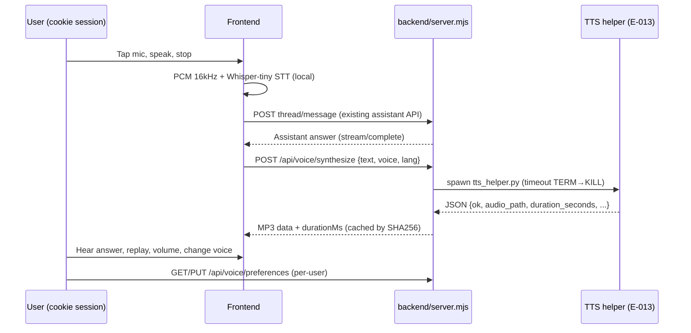

# API Contracts

> `Last updated by: SWE3-B-04` (2026-09-21, all `/api/voice/*` signatures real — TC-A adds no endpoints)

| Endpoint | Method | Auth | Payload / Response | Owner |
|----------|--------|------|-------------------|-------|
| `/api/auth/session` | GET | Public | Session probe | — |
| Assistant thread/message routes | * | Cookie session, per-user | Existing (Epic 010) — voice submit reuses `POST /assistant/threads`, `POST /assistant/threads/:id/messages` via `createAssistantThread` / `stream\|sendAssistantThreadMessage` | SWE3-A-02 ✅ |
| `/api/voice/status` | GET | Cookie session | `{voice: {available, sdkVersion, voices[], modelDirConfigured, detail}}` — probe TTL 60 s, failures never cached permanently | SWE3-B-01 ✅ |
| `/api/voice/synthesize` | POST | Cookie session | `{text (1–1000), voice (M1–M5/F1–F5), lang}` → `{voice: {audioBase64 WAV, mimeType 'audio/wav', voice, language, cacheHit}}`; 400 invalid / 503 engine down / 504 timeout / 500; per-user cache-first | SWE3-B-01 ✅ |
| `/api/voice/preferences` | GET/PUT | Cookie session, per-user | `{voicePreferences: {ttsEnabled, voice, volume, updatedAt}}`; PUT validates voice enum + volume int 0–100 (400); defaults `{true,'F1',80}`; upsert on `owner_user_id` | SWE3-B-03 ✅ |
| `/api/voice/samples/:voice` | GET | Cookie session | `?lang=` (default `na`→en sample text); fixed per-language sample sentence; same cache-first pipeline as synthesize; 400 unknown voice | SWE3-B-03 ✅ |
