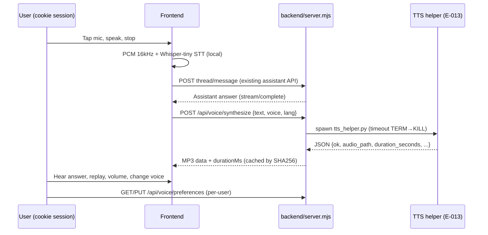

# API Contracts

> `Last updated by: swaibian-architect-no-reviews` (2026-09-21, scaffold — real data populated by TC-A-04 / TC-B-04)

| Endpoint | Method | Auth | Payload / Response | Owner |
|----------|--------|------|-------------------|-------|
| `/api/auth/session` | GET | Public | Session probe | — |
| Assistant thread/message routes | * | Cookie session, per-user | Existing (Epic 010) — reused by voice submit | TC-A-04 notes |
| `/api/voice/status` | GET | Cookie session | Readiness: import/version/files/voices | TC-B-01 → TC-B-04 populates |
| `/api/voice/synthesize` | POST | Cookie session | `{text, voice, lang}` → MP3 + durationMs; errors fail closed | TC-B-01 → TC-B-04 populates |
| `/api/voice/preferences` | GET/PUT | Cookie session, per-user | `{ttsEnabled, voice, volume}` validated | TC-B-03 → TC-B-04 populates |
| `/api/voice/samples/:voice` | GET | Cookie session | Preset preview audio | TC-B-03 → TC-B-04 populates |

Populated by the TC's last implementation issue (TC-A-04: reused endpoints; TC-B-04: new `/api/voice/*` signatures).
