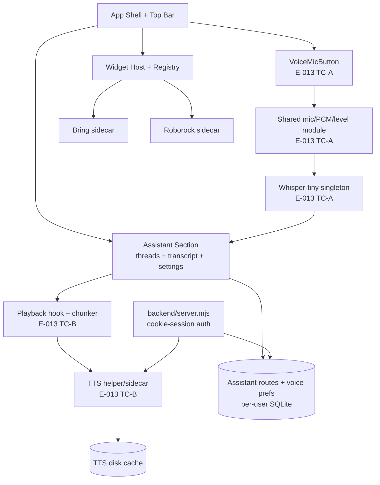

# Component Overview

> `Last updated by: swaibian-architect-no-reviews` (2026-09-21, scaffold — real data populated by TC-A-04 / TC-B-04)

| Element | Description | Owner |
|---------|-------------|-------|
| App Shell + Top Bar | Board layout, auth bootstrap, mic mount point (desktop + mobile) | TC-A-02/03 |
| Shared mic/PCM/level module | Permission, 16 kHz normalizer, level hook (Epic 007 reuses) | TC-A-01 |
| Whisper-tiny singleton | In-process STT + vocabulary correction | TC-A-02 |
| Playback hook + chunker | Markdown-strip, 2–5 sentence chunks, autoplay/volume/replay | TC-B-02 |
| TTS helper/sidecar | Supertonic-3 bridge, status probe, timeout/buffer discipline | TC-B-01 |
| Voice prefs | Per-user toggle/voice/volume + samples in assistant settings | TC-B-03 |
| Backend + SQLite | Cookie sessions, per-user scoping, `/api/*` routes | TC-B-01/03 |

Populated by the TC's last implementation issue (TC-A-04 for capture, TC-B-04 for synthesis).
