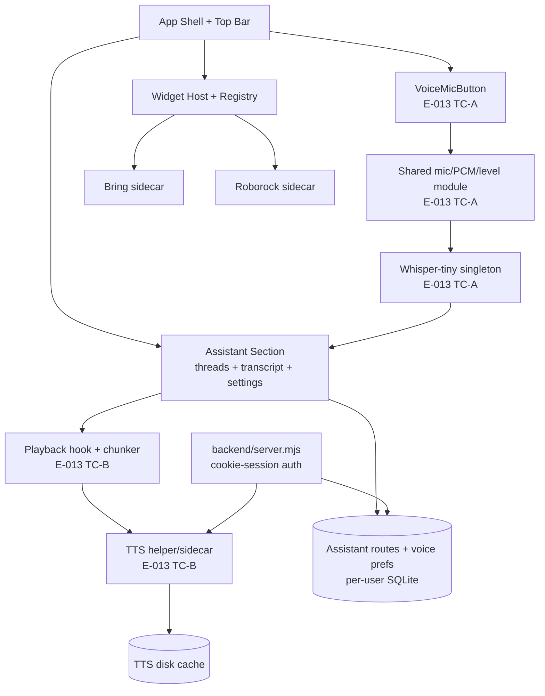

# Component Overview

> `Last updated by: SWE3-A-04` (2026-09-21, voice-capture modules populated — synthesis owned by SWE3-B-04)

| Element | Description | Owner |
|---------|-------------|-------|
| App Shell + Top Bar | Board layout, auth bootstrap; mic lives in persistent `terminal-cell--voice` (desktop + mobile, never collapsed) | SWE3-A-02/03 ✅ |
| Shared mic/PCM/level module | `frontend/src/voice/audioInput.ts` (permission, 16 kHz normalizer, validation, RMS) + `audioLevel.ts` (monitor, sampler, mic source) — Epic 007 reuses, no history merge | SWE3-A-01 ✅ |
| Vocabulary module | `frontend/src/voice/vocabulary.ts` (`buildInitialPrompt`, `postCorrectTranscript`, `normalizeSttLanguage`) | SWE3-A-01 ✅ |
| Whisper-tiny singleton | `frontend/src/voice/stt.ts` (lazy cache per language, dynamic import, offline flags, fail-closed) — model binaries not yet vendored (TC-B-01 distribution) | SWE3-A-02 ✅ |
| Capture controller + hook | `frontend/src/voice/voiceCapture.ts` + `useVoiceCapture.ts` (states, silence auto-stop, mic release, busy guard) | SWE3-A-02 ✅ |
| Mic button + input circle | `VoiceMicButton.tsx` + `InputLevelCircle.tsx` + `voiceCircle.ts` + `voiceCopy.ts` (11-code en/de/fr/es taxonomy) | SWE3-A-03 ✅ |
| Playback hook + chunker | Markdown-strip, 2–5 sentence chunks, autoplay/volume/replay | SWE3-B-02 (stub) |
| TTS helper/sidecar | Supertonic-3 bridge, status probe, timeout/buffer discipline | SWE3-B-01 (stub) |
| Voice prefs | Per-user toggle/voice/volume + samples in assistant settings | SWE3-B-03 (stub) |
| Backend + SQLite | Cookie sessions, per-user scoping, `/api/*` routes (TC-A adds no endpoints) | — |
