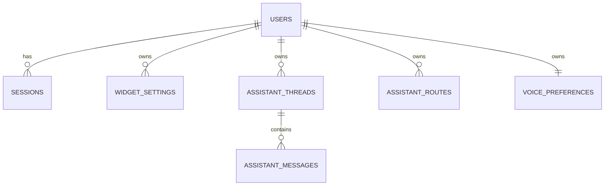

# Data Model

> `Last updated by: SWE3-B-04` (2026-09-21, voice_preferences populated — confirmed by SWE3-A-04: TC-A adds no tables)

| Table (confirmed) | Key columns | Owner |
|-------------------------------------|-------------|-------|
| `users`, `sessions` | Existing auth model (Epic 003) | — |
| `assistant_threads/messages/routes` | Existing assistant model (Epic 010) | — |
| `voice_preferences` | `owner_user_id` TEXT PK → users(id), `tts_enabled` INTEGER DEFAULT 1, `voice` TEXT DEFAULT 'F1', `volume` INTEGER DEFAULT 80, `updated_at` TEXT — upserted via `PUT /api/voice/preferences`, defaults for new users | SWE3-B-03 ✅ |
| TTS cache | Disk entries under `backend/data/voice-cache/<safeUserId>/<sha256>.wav`; key = SHA256(sdk\|text\|voice\|lang); eviction 7 d / 500 MB oldest-first — NOT a DB table | SWE3-B-01 ✅ |
