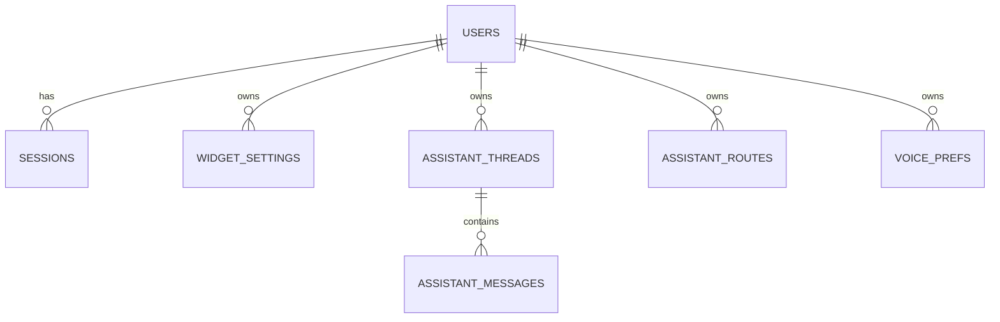

# Data Model

> `Last updated by: swaibian-architect-no-reviews` (2026-09-21, scaffold — real data populated by TC-B-04)

| Table (planned/confirmed by closer) | Key columns | Owner |
|-------------------------------------|-------------|-------|
| `users`, `sessions` | Existing auth model (Epic 003) | — |
| `assistant_threads/messages/routes` | Existing assistant model (Epic 010) | — |
| `voice_prefs` | `user_id`, `tts_enabled`, `voice` (M1–M5/F1–F5), `volume`, `updated_at` — exact shape decided TC-B-03 | TC-B-04 populates |
| TTS cache | Disk entries keyed SHA256(sdk+text+voice+lang), age/size eviction — not a DB table | TC-B-04 populates |

Populated by the TC's last implementation issue (TC-B-04 confirms storage shape; TC-A stores nothing — ephemeral audio only).
