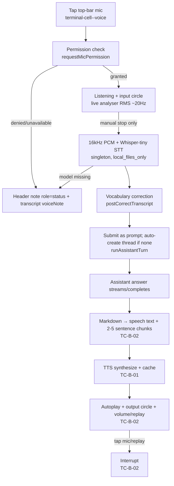

# Flow: Assistant Voice Loop (E-013)

> `Last updated by: SWE3-B-04` (2026-09-21, TC-B close: synthesis half + full loop populated)

| Step | Component | Key rule | Owner |
|------|-----------|----------|-------|
| A–C | `VoiceMicButton` + `InputLevelCircle` in `terminal-cell--voice` (persistent, survives mobile collapse) | Explicit tap only; scalars drive circle; keyboard suppressed while active (`isVoiceCaptureActiveState` gates `focusin`) | SWE3-A-02/03 ✅ |
| D–V | `stt.ts` singleton + `vocabulary.ts` | Bundled model path `/voice-models/whisper-tiny`, `local_files_only`, remote disabled; fail closed `model-missing`; `initial_prompt` deferred (v4.3.0 lacks it) | SWE3-A-01/02 ✅ |
| S–T | `VoiceCaptureController` → `handleVoiceTranscriptSubmit` → `runAssistantTurn` | Mic released after blob; busy fails closed; transcript preserved on `submit-failed`; reuses `createAssistantThread`/`stream|sendAssistantThreadMessage` | SWE3-A-02 ✅ |
| Errors | `resolveVoiceErrorCopy` → header note + `voiceNote` | 11 codes, en/de/fr/es, unknown-code fallback | SWE3-A-03 ✅ |
| M | `speechText.ts` strip + chunk (2–5 sentences, single long sentence never split; fenced code fully removed) | Markup never read aloud | SWE3-B-02 ✅ |
| Y | `POST /api/voice/synthesize` → `ttsBridge.synthesizeSpeech` → spawn `tts_helper.py` (JSON-on-stdout, TERM→KILL, 120 s) → WAV → `voiceCache` (SHA256 sdk\|text\|voice\|lang, 7 d / 500 MB) → base64 WAV | Offline flags + model dir in production; 503/504 fail-closed; per-user cache | SWE3-B-01 ✅ |
| P | `useVoicePlayback` queue → `createDomAudioPlayer` → analyser → `OutputLevelCircle` + volume + per-message replay | Autoplay on `commitAssistantTurn`; mic tap interrupts; disabled-TTS silence | SWE3-B-02 ✅ |
| Prefs | `GET/PUT /api/voice/preferences` + `GET /api/voice/samples/:voice?lang=` + settings voice section → `voicePrefsStore` → live playback guard | Per-user table; clamp/validate; two-session isolation proven | SWE3-B-03 ✅ + close |
