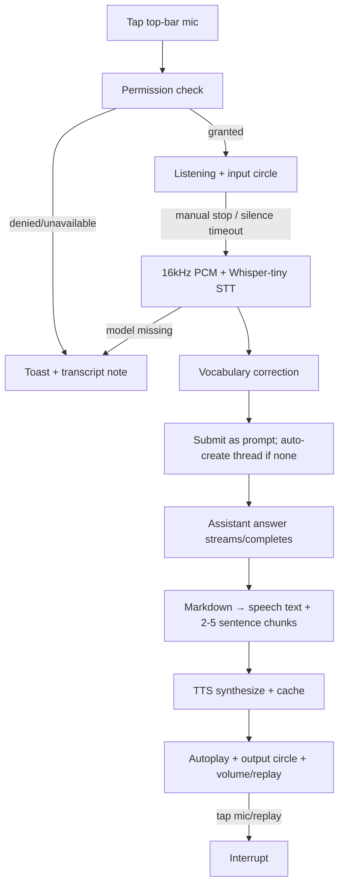

# Flow: Assistant Voice Loop (E-013)

> `Last updated by: swaibian-architect-no-reviews` (2026-09-21, scaffold — real data populated by TC-A-04 (capture half) / TC-B-04 (synthesis half + full loop))

| Step | Component | Key rule | Owner |
|------|-----------|----------|-------|
| A–C | Top-bar mic + permission + input circle | Explicit tap only; scalars drive circle; keyboard suppressed while active | TC-A-02/03 → TC-A-04 populates |
| D–V | STT + correction | Bundled model, `local_files_only`; `initial_prompt` + regex list; ephemeral buffers | TC-A-01/02 → TC-A-04 populates |
| S–T | Submit + answer | Reuses assistant API; busy-turn guard; thread auto-create | TC-A-02 → TC-A-04 populates |
| M–P | Strip/chunk/synth/playback | No markup spoken; chunk offsets stack; interrupt always available | TC-B-01/02 → TC-B-04 populates |
| Prefs | Voice section | Per-user toggle/voice/volume + samples; denial + isolation tested | TC-B-03 → TC-B-04 populates |

Populated by the TC's last implementation issue.
